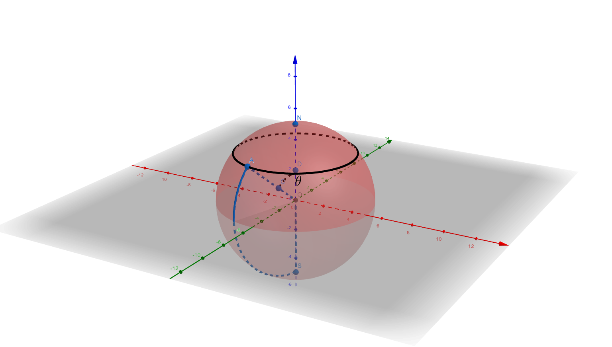

# RPE 3D Radius Reconstruction

This is the Python and MATLAB implementation of the method to estimate the 3D eyeball radius from the 2D flat-mount images. 

## Method Explanation

Refer to the IPython Notebook [`demo.ipynb`](./demo.ipynb) for the brief explanation of the method.

## Usage

1. Refer to the IPython Notebook [`demo.ipynb`](./demo.ipynb) for the example code in Python.

2. The MATLAB graphical user interface is available in [RPE_Radius_Estimation_MATLAB_GUI](./RPE_Radius_Estimation_MATLAB_GUI). Refer to the [tutorial](./RPE_Radius_Estimation_MATLAB_GUI/UserGuide.pptx) for more information on how to use this interface.

### k_estimator.mlapp

This user interface [`k_estimator.mlapp`](./RPE_Radius_Estimation_MATLAB_GUI/k_estimator.mlapp) can utilize a flat-mount eyeball image and the corresponding eyeball radius $R$ to estimate the tissue distortion coefficient k.

Users should first load a spreadsheet that contains the following information about eyeballs: image name, image path, ground truth radius, and unit conversion ratio. As radius is measured in millimeter and image is represented by pixels, a conversion ratio is necessary to compute the conversion. Next, Users can set a concentric circle origin and lobe marker points for each image. The distance between the origin point and the closest lobe marker point is L. Next, we sample a series of l in the interval [0, L] and measure corresponding $gap$ according to image pixel values. The tissue distortion coefficient k is next estimated.

### r_estimator.mlapp

This user interface [`r_estimator.mlapp`](./RPE_Radius_Estimation_MATLAB_GUI/r_estimator.mlapp) estimates eyeball sphere radius R. The interface needs to load two files. The first file is the output from [`k_estimator.mlapp`](./RPE_Radius_Estimation_MATLAB_GUI/k_estimator.mlapp), which provides the value of the tissue distortion coefficient k. Another file is a spreadsheet including eyeball information: image names, image paths, and unit conversion ratios. Users need to annotate concentric circle origin and lobe marker points for each image before the software produces estimated eyeball radius.

## Reference

Reference information to be added.
